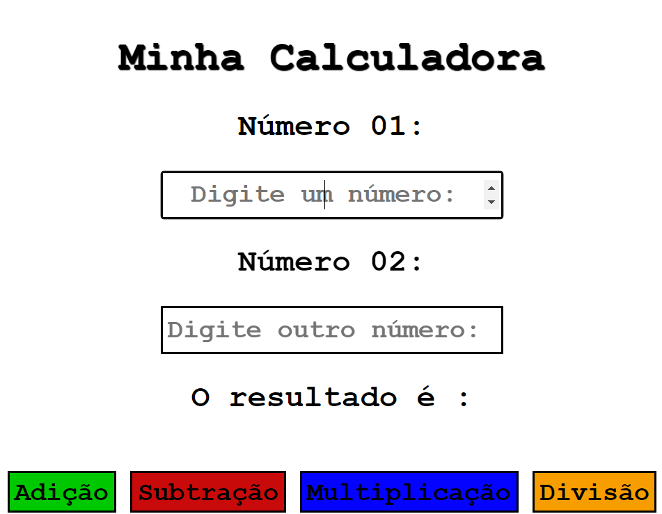

# Minha Primeira Calculadora

## Olá 👋🏾! O projeto consiste em uma calculadora extremamente simples, que possui apenas:

- HTML;
- CSS;
- JS.

## Como já foi dito, é muito simples e com pouquíssimo estilo e interatividade, fazendo apenas o básico: adicionar, subtrair, multiplicar e dividir.

[]

### Até breve...
